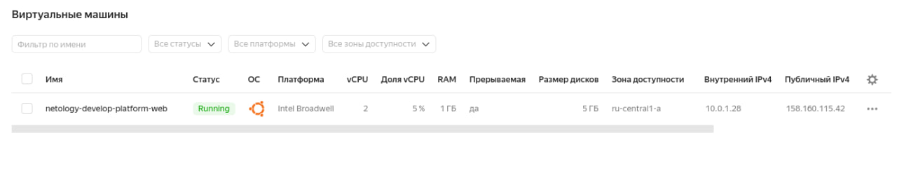
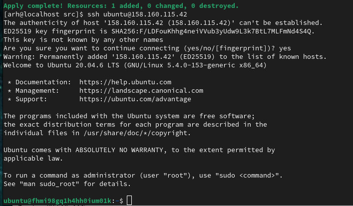
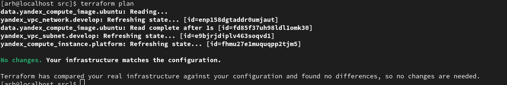

# devops-netolog  
### **Задание 1**  
**Cкриншот ЛК Yandex Cloud с созданной ВМ**  
  

**скриншот успешного подключения к консоли ВМ через ssh(к OS ubuntu необходимо подключаться под пользователем ubuntu: "ssh ubuntu@vm_ip_address")**  
  

**Ответы на вопросы**   
*Исправьте намеренно допущенные синтаксические ошибки. Ищите внимательно, посимвольно. Ответьте в чем заключается их суть?*  
1. Ошибка в написании платформы - "standart...", вместо  "standard";
2. **core_fraction=5** - базовый уровень производительности vCPU.  Этот уровень определяет   долю вычислительного времени физических ядер, которую гарантирует vCPU. Минимальные конфигурации указаны для уровня производительности 5%, максимальные — для 100%.  
**preemptible = true** - Признак создания прерываемой машины. Если если он трушный, то созданная машины будет являться прерываемой. Прерываемая машины дешевле, но может быть остановлена в любой момент.  
В процессе обучения не требуются не прерываемые машины высокой производительности. Эти параметры позволят сократить расходы на создаваемые в процессе обучения ВМ. 

### **Задание 2**  

  

### **Задание 4**  
```
[arh@localhost src]$ terraform output
vm_db_xternal_ip = "130.193.51.147"
vm_web_xternal_ip = "84.201.128.49"
```
### **Задание 7**
  1.

  2.

  3.

  4.
